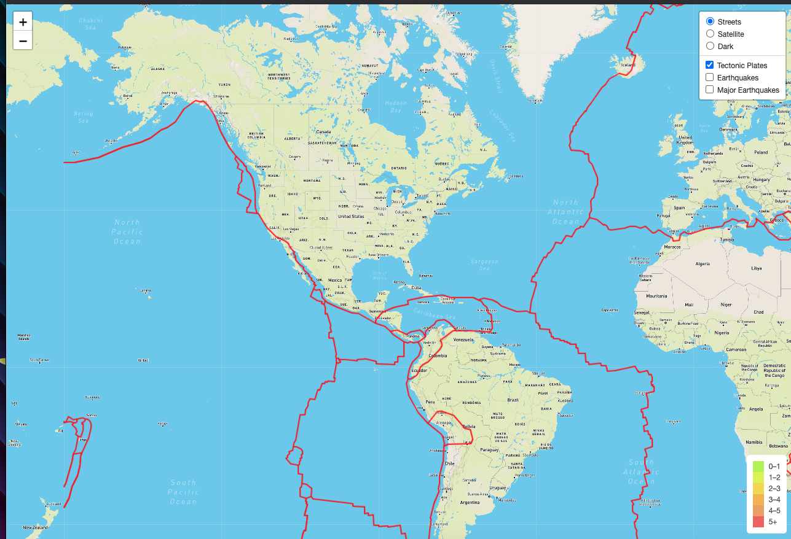
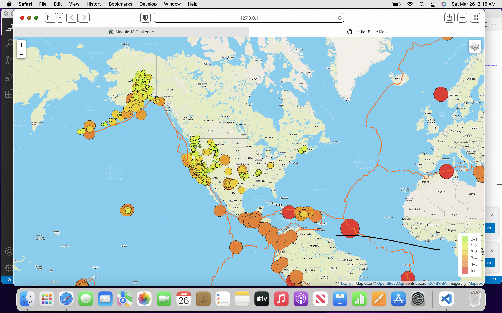

#  Mapping Earthquakes
 Basil and Sadhana would like to see the earthquake data in relation to the tectonic plates’ location on the earth, and they would like to see all the earthquakes with a magnitude greater than 4.5 on the map, and they would like to see the data on a third map. Since information is in real time, the map will update whenever they access it. Scripts are built using java script and mapbox using the leaflit libarary.

##Findings 
Delievarables:

Conclusion: Basil and Sadhana now have an interactive map that shows when earthquakes have happened.
